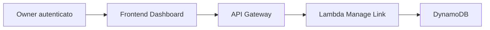

# Architettura Tecnica

## Scelta architetturale

Per l'MVP la soluzione migliore e' un'architettura serverless su AWS:

- minimizza costi fissi;
- riduce il carico operativo;
- scala bene su picchi di scansioni;
- separa chiaramente traffico pubblico di redirect e traffico autenticato di gestione.

## Componenti

- Frontend SPA `React + TypeScript + Vite` su `S3 + CloudFront`
- Autenticazione MVP su `admin login semplificato`
- API su `Amazon API Gateway HTTP API`
- Business logic su `AWS Lambda`
- Persistenza su `Amazon DynamoDB`

## Flussi principali

### Redirect pubblico

```mermaid
flowchart LR
  U[Utente che scansiona] --> QR[QR Code sulla maglietta]
  QR --> API[API Gateway /r/{shirtId}]
  API --> L1[Lambda Redirect]
  L1 --> DDB[DynamoDB]
  L1 --> DEST[URL finale]
```

### Gestione privata



## Motivazioni FE

- `React + TypeScript` e' una scelta solida per una dashboard utente con form, stato autenticazione e validazioni.
- `Vite` accelera lo sviluppo locale e produce un output statico semplice da distribuire.
- Una SPA e' sufficiente per dashboard, onboarding e gestione link.
- Hosting statico su S3/CloudFront e' economico e semplice da distribuire.
- Il frontend dialoga con API Gateway tramite HTTPS.
- Per il day-1 e' stato scelto un login admin semplificato, piu' veloce da portare online rispetto a Cognito.

## Motivazioni BE

- Lambda isola bene i casi d'uso: redirect, login admin, creazione QR, update link.
- API Gateway gestisce routing e CORS senza costi fissi elevati.
- DynamoDB offre letture rapide e latenza bassa, adatta al redirect.

## Dominio dati MVP

- `shirts`: maglietta, redirect stabile e link di destinazione corrente.

Per l'MVP tutto puo' convivere in una singola tabella DynamoDB.

## Nota implementativa FE

Il frontend dovra' esporre almeno queste schermate:

- landing di onboarding;
- login admin;
- creazione della prima maglietta;
- dashboard con lista magliette;
- preview del QR code stabile;
- form di aggiornamento URL;
- fallback page per QR non ancora attivati.

## Evoluzione futura

Quando l'MVP sara' validato, il passo naturale sara' sostituire il login admin semplificato con Amazon Cognito e reintrodurre il self-service utente finale per il claim della maglietta.
